# LAPORAN RESMI PRAKTIKUM JARINGAN KOMPUTER
## Modul 1 — Kelas K-30 (2026)

| Nama | NRP |
| --- | --- |
| Yuan Banny Albyan | 5027241027 |
| Akbar Reyhan Fabian Susanto | 5027251053 |

---

## Daftar Isi

**Bagian A — Konfigurasi Topologi & Layanan Jaringan (Soal 1–13)**
**Bagian B — Analisis Paket / Wireshark Forensics (Soal 14–20)**

---

## BAGIAN A — Konfigurasi Topologi & Layanan Jaringan

### Soal 1 — Membangun Topologi Tree

**Deskripsi Soal**
Membangun topologi jaringan berbentuk *tree* (pohon), dengan satu node bernama **Lain** sebagai *root*, dan node-node lainnya berperan sebagai *leaf* (daun) yang terhubung ke root tersebut.

**Konfigurasi Interface pada Node Leaf**

Setiap node *leaf* menggunakan `eth0` sebagai interface yang mengarah ke root, dikonfigurasi secara statis:

```
auto eth0
iface eth0 inet static
    address 192.226.a.b
    netmask 255.255.255.0
    gateway 192.226.a.c
```

Keterangan:
- `a` — oktet subnet, menyesuaikan dengan gateway (root) yang dituju.
- `c` — host ID dari gateway/root (**Lain**), yaitu `1`.
- `b` — host ID dari node leaf itu sendiri, bebas dipilih pada rentang `2`–`254`.

**Konfigurasi Interface pada Node Root (Lain)**

```
auto eth0
iface eth0 inet dhcp
    up sysctl -w net.ipv4.ip_forward=1
    up iptables -t nat -A POSTROUTING -o eth0 -j MASQUERADE

auto ethn
iface eth1 inet static
    address 192.226.1.1
    netmask 255.255.255.0
```

Keterangan:
- `eth0` pada root dikonfigurasi sebagai client DHCP yang mengarah ke jaringan NAT (internet).
- Interface `ethN` (menyesuaikan jumlah leaf) dikonfigurasi statis dan menghadap ke masing-masing jaringan leaf.
- Perintah `sysctl -w net.ipv4.ip_forward=1` mengaktifkan IP forwarding pada kernel, sehingga root dapat meneruskan paket antar-interface.
- Aturan `iptables ... MASQUERADE` melakukan *source NAT*: paket yang keluar melalui `eth0` menuju NAT akan disamarkan menggunakan alamat IP lokal root (bukan IP asli leaf), sehingga trafik dari jaringan internal dapat keluar ke NAT/internet.

---

### Soal 2 — Konfigurasi IP Forwarding & DNS pada Leaf

**Deskripsi Soal**
Memasang aturan `iptables` pada node **Lain** agar dapat meneruskan (forward) paket dari masing-masing interface leaf (`eth1`, `eth2`, `eth3`) menuju `eth0` (interface ke arah internet/NAT), serta mengatur *nameserver* `8.8.8.8` pada setiap node leaf.

**Konfigurasi iptables pada Root**

```
iptables -t nat -A POSTROUTING -o eth0 -j MASQUERADE 
iptables -A FORWARD -i eth1 -o eth0 -j ACCEPT 
iptables -A FORWARD -i eth2 -o eth0 -j ACCEPT
iptables -A FORWARD -i eth3 -o eth0 -j ACCEPT 
iptables -A FORWARD -i eth0 -m state --state ESTABLISHED,RELATED -j ACCEPT
```

**Analisis**
Empat aturan pertama mengizinkan trafik yang berasal dari tiap interface leaf (`eth1`–`eth3`) diteruskan keluar melalui `eth0`. Aturan terakhir mengizinkan paket balasan (respons) yang statusnya `ESTABLISHED` atau `RELATED` untuk masuk kembali dari `eth0`, sehingga komunikasi dua arah (request dari leaf, response dari internet) dapat berjalan.

---

### Soal 3 — Uji Konektivitas Antar-Leaf

**Deskripsi Soal**
Melakukan pengujian *ping* untuk memverifikasi bahwa antar-node leaf yang berada di bawah root **Lain** dapat saling terhubung.

**Hasil Pengujian**

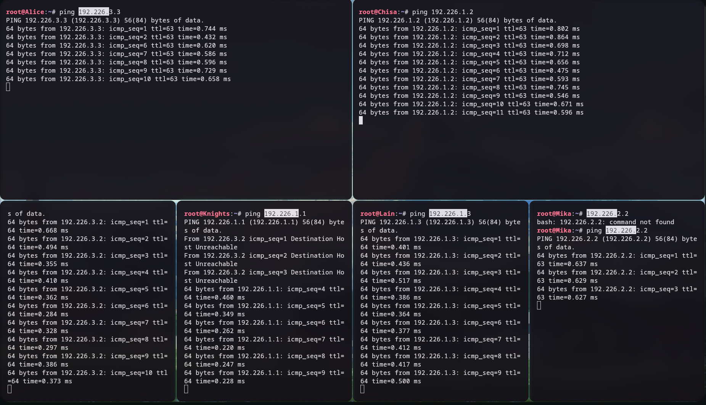

Pengujian ping antar-leaf berhasil, menandakan proses forwarding pada root telah berjalan dengan benar untuk trafik internal.

---

### Soal 4 — Uji Konektivitas ke Internet (NAT)

**Deskripsi Soal**
Menambahkan *nameserver* `8.8.8.8` pada node leaf agar dapat melakukan resolusi DNS dan terhubung ke jaringan NAT/internet, kemudian diuji dengan ping.

**Hasil Pengujian**

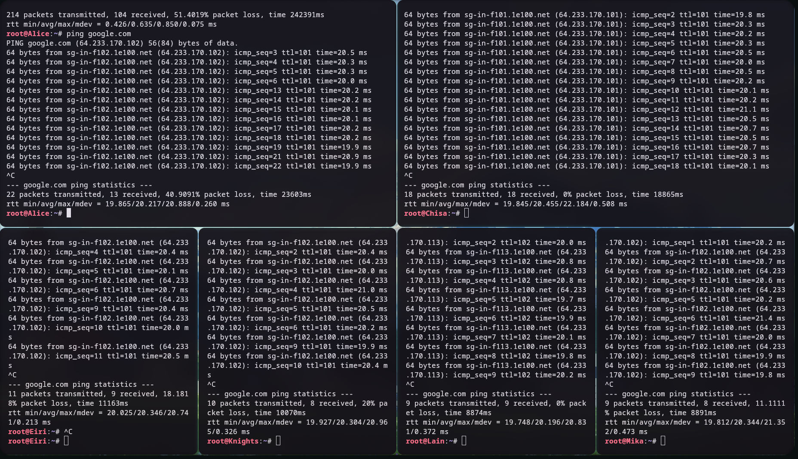

Setelah nameserver `8.8.8.8` ditambahkan pada konfigurasi resolver leaf, node leaf berhasil melakukan ping ke luar jaringan (internet), membuktikan bahwa proses NAT dan DNS resolution pada root sudah berfungsi sebagaimana mestinya.

---

### Soal 5 — Otomatisasi Konfigurasi via `.bashrc`

**Deskripsi Soal**
Agar seluruh konfigurasi jaringan (interface, iptables, dsb.) otomatis diterapkan kembali setiap kali node/container dijalankan ulang, seluruh perintah konfigurasi dimasukkan ke dalam `.bashrc` pada masing-masing node.

**Pendekatan**
- Perintah dapat dituliskan langsung di dalam `.bashrc`, **atau**
- Perintah dikumpulkan dalam sebuah *script* terpisah yang diletakkan di direktori `root`, kemudian dipanggil (di-*execute*) dari dalam `.bashrc`.

Pendekatan ini memastikan environment jaringan selalu ter-*restore* otomatis begitu node melakukan booting ulang, tanpa perlu mengetik ulang seluruh konfigurasi secara manual.

---

### Soal 6 — Capture Trafik DNS & ICMP dengan Wireshark

**Deskripsi Soal**
Mengunduh berkas skenario, kemudian melakukan *packet capture* menggunakan Wireshark pada node **mika** untuk menganalisis trafik DNS dan ICMP.

**Langkah Pengerjaan**

```
curl -L "https://drive.usercontent.google.com/download?id=1G9zIi20ofbOgfffor-i-e7QKU3Ihe42W&export=download&confirm=t" -o nama_file.zip
```

1. Meng-install *unzipper* untuk mengekstrak berkas (`unzip`).
2. Pada GNS3, klik kanan pada kabel yang terhubung ke node **mika**, lalu pilih **Start Capture**.
3. Wireshark terbuka secara otomatis; jalankan *bash script* skenario pada node **mika**.
4. Terapkan filter tampilan (*display filter*) `dns || icmp` pada Wireshark.

**Hasil Capture**

[Berkas capture: soal6.pcapng](wireshark/soal6.pcapng)

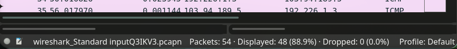

**Analisis**
Berdasarkan filter yang diterapkan, paket yang **tampil pada display filter** (`dns || icmp`) berjumlah 88,9% dari keseluruhan trafik yang ter-capture, sementara **tidak ada paket yang benar-benar hilang/di-drop** pada level capture — seluruh paket (100%) berhasil diterima oleh interface capture.

---

### Soal 7 — Setup FTP Server (vsftpd) dan Access Control List (ACL)

**Deskripsi Soal**
Meng-install layanan FTP server beserta ACL untuk mengatur hak akses tiap pengguna terhadap direktori bersama.

**Instalasi Paket**

```
apt update && apt install ftp acl -y
```
`ftp` digunakan sebagai *File Transfer Protocol* client/tools, sedangkan `acl` digunakan untuk mengatur *Access Control List* pada filesystem.

**Setup User**

```
useradd -M eiri && passwd eiri
useradd -M alice && passwd alice
useradd -M mika && passwd mika
```

**Setup Access Control**

```
mkdir -p /var/wired/data
setfacl -m u:alice:rwx /var/wired/data
setfacl -m u:mika:r-x /var/wired/data
usermod -d /var/wired/data/ alice
usermod -d /var/wired/data/ mika
```

Direktori `/var/wired/data` dijadikan direktori kerja bersama. `alice` diberi izin baca-tulis-eksekusi penuh (`rwx`), sedangkan `mika` hanya diberi izin baca dan eksekusi (`r-x`).

**Setup FTP Server (vsftpd)**

```
apt install vsftpd
```

Konfigurasi `/etc/vsftpd.conf`:

```
anonymous_enable=NO
local_enable=YES
write_enable=YES
chroot_local_user=YES
allow_writeable_chroot=YES
userlist_enable=YES
userlist_deny=YES
userlist_file=/etc/vsftpd.user_list
```

```
echo "eiri" > /etc/vsftpd.user_list
```

Verifikasi user:

```
root@Chisa:~# getent passwd alice mika eiri
alice:x:1000:1000::/var/wired/data:/bin/sh
mika:x:1001:1001::/var/wired/data:/bin/sh
eiri:x:1002:1002::/home/eiri:/bin/sh
```

**Menjalankan Service**

```
service vsftpd start
service vsftpd status
```

**Pengujian**

```
echo "Signal from Alice" > signal_alice.txt
ftp <IP_Chisa>
put signal_alice.txt
```

POV Alice (upload berhasil):

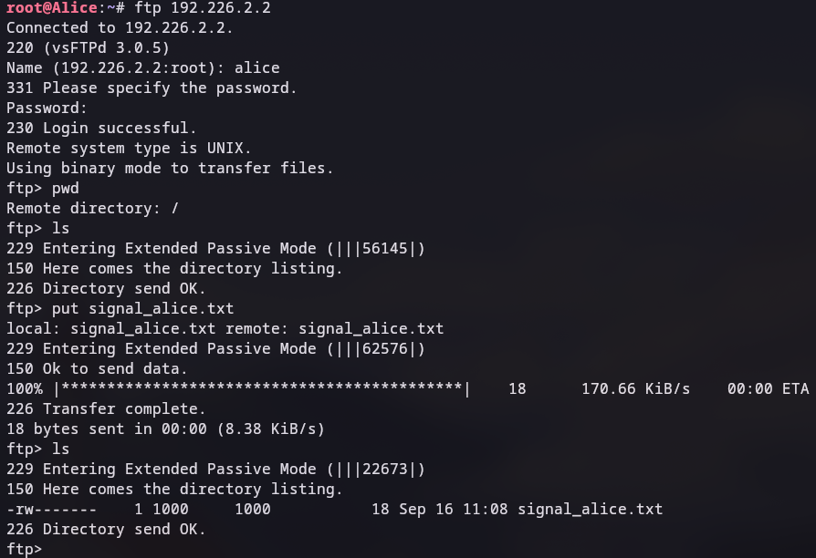

POV Chisa (server), file berhasil tersimpan:

```
root@Chisa:~# ls /var/wired/data/
signal_alice.txt
```

POV Mika (percobaan `get` gagal):

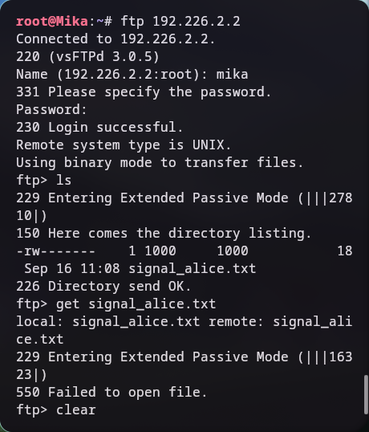

Kegagalan ini disebabkan izin `mika` pada direktori `/var/wired/data` hanya berupa ACL eksplisit (`r-x`), namun tidak memiliki **default ACL**, sehingga izin tidak diwariskan pada saat listing/akses file baru.

**Perbaikan**

```
setfacl -m d:u:mika:r-x /var/wired/data/
setfacl -m d:u:alice:rwx /var/wired/data/
service vsftpd restart
```
Kemudian file di-upload ulang oleh alice.

POV Mika setelah perbaikan default ACL (berhasil):

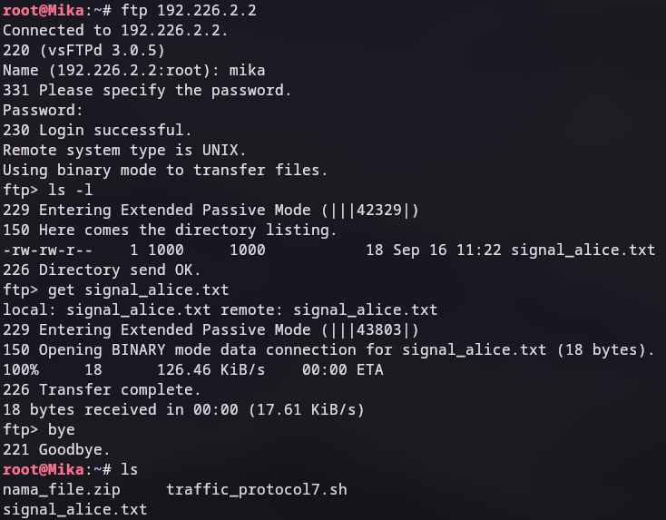

POV Eiri (ditolak akses / banned):

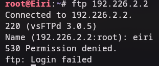

`eiri` ditolak karena tidak terdaftar dalam `userlist_file` (`/etc/vsftpd.user_list`), sesuai konfigurasi `userlist_deny=YES`.

---

### Soal 8 — Analisis Transfer FTP (STOR & EPSV) pada Wireshark

**Deskripsi Soal**
Mengunduh dan mengekstrak berkas skenario kedua, kemudian menganalisis proses upload file melalui FTP menggunakan Wireshark.

**Langkah Pengerjaan**

```
curl -L "https://drive.usercontent.google.com/download?id=1lFepK4wFmx55PnRki3NsHW-ivudSR0vg&export=download&confirm=t" -o nama_file.zip
apt install p7zip-full
7z x nama_file.zip
```

**Login FTP**


**Upload `knights_report.txt`**


**Analisis Wireshark**

Perintah `STOR` menandai dimulainya proses upload. Transfer data berjalan melalui koneksi TCP terpisah (data channel), pada contoh ini `56180 → 29430`, dan diakhiri dengan kode status `226` yang menandakan transfer selesai dengan sukses.


Ditemukan juga penggunaan mode **EPSV (Extended Passive Mode)** untuk negosiasi port data channel. Alur komunikasi client (C) – server (S) FTP secara umum adalah sebagai berikut:

1. C melakukan koneksi ke S melalui FTP (port kontrol 21).
2. C mengirim permintaan `put` file, sehingga perlu meminta port untuk transfer data (TCP).
3. Server dan client masuk ke mode **EPSV**, port data disepakati.
4. Transfer file dilakukan pada port data tersebut.
5. Koneksi data channel (EPSV) ditutup.
6. Komunikasi kembali dilanjutkan pada *command channel* (port 21).

---

### Soal 9 — Kegagalan Upload FTP (Error 553)

**Deskripsi Soal**
Mengunduh dan mengekstrak berkas skenario ketiga di direktori `/var/wired/data`, lalu menguji proses download dan upload file FTP.

**Langkah Pengerjaan**

```
curl -L "https://drive.usercontent.google.com/download?id=1tKZu0rcti4t-fXX4jtXDSKDBWzsawfoN&export=download&confirm=t" -o nama_file.zip
apt install p7zip-full
7z x nama_file.zip
```

**Hasil — Download (get) Berhasil**


Proses download (`get`) dari server Chisa melalui perantara node mika berjalan sukses.

**Hasil — Upload (put) Gagal**


Proses upload gagal dengan kode error **`553 Could not create file`**. Kesimpulan analisis: kegagalan ini **bukan disebabkan oleh permission denied**, melainkan karena server (menjalankan `vsftpd 3.0.5`) gagal membuat berkas pada path/nama yang diminta.

---

### Soal 10 — Analisis Paket ICMP (Ping) ke Node Knights

**Deskripsi Soal**
Melakukan pengujian ping ke node **Knights** dan menganalisis paket ICMP beserta statistik hasilnya pada Wireshark.

**ICMP Echo Reply (Type 0, Code 0)**


**ICMP Echo Request (Type 8, Code 0)**


**Statistik Hasil Ping**


```
77 packets transmitted, 38 received, 50.6493% packet loss, time 25669ms
rtt min/avg/max/mdev = 0.545/0.685/0.908/0.086 ms
```

| Parameter | Nilai |
| --- | --- |
| Packet loss | ≈ 50,65% |
| RTT minimum | 0,545 ms |
| RTT rata-rata (avg) | 0,685 ms |
| RTT maksimum | 0,908 ms |
| Standar deviasi (mdev) | 0,086 ms |

---

### Soal 11 — Analisis Trafik Telnet (Plaintext)

**Deskripsi Soal**
Meng-install dan mengaktifkan layanan Telnet pada node **Chisa**, kemudian menganalisis isi komunikasinya melalui Wireshark.

**Langkah Pengerjaan**

```
useradd -M phantom_user
passwd phantom_user
```

Pada node Chisa, install `telnetd`, lalu pastikan service berjalan di port 23:

```
ss -lnt | grep ':23'
```

**Kendala:** port 23 tidak aktif. Solusi:

```
echo 'telnet stream tcp nowait root /usr/sbin/telnetd telnetd' >> /etc/inetd.conf
service inetutils-inetd restart
```

**Pengujian dari Node Mika**

```
telnet <IP_Chisa>
```


Pada Wireshark, klik kanan pada paket *TCP handshake* pertama → **Follow → TCP Stream → Show as ASCII**, untuk melihat isi komunikasi Telnet dalam bentuk teks biasa (plaintext), termasuk kredensial login yang tidak terenkripsi.

---

### Soal 12 — Pengujian Port dengan Netcat & Analisis TCP Handshake

**Deskripsi Soal**
Menguji ketersediaan layanan pada beberapa port di node **Knights** menggunakan `nc`, kemudian menganalisis pola TCP handshake-nya.

**Percobaan Awal (Belum Ada Service)**


```
root@Alice:~# nc -zv 192.226.3.2 22
nc: connect to 192.226.3.2 port 22 (tcp) failed: Connection refused
root@Alice:~# nc -zv 192.226.3.2 80
nc: connect to 192.226.3.2 port 80 (tcp) failed: Connection refused
root@Alice:~# nc -zv 192.226.3.2 7777
nc: connect to 192.226.3.2 port 7777 (tcp) failed: Connection refused
```

**Solusi**
Menjalankan layanan pada port yang diuji, misalnya dengan meng-install `openssh-server` dan `nginx` (untuk SSH & HTTP), atau menjalankan program apa pun (termasuk `nc`) yang listen pada port tersebut:

```
root@Knights:~# ss -lntp | grep -E ':22|:80'
LISTEN 0      1            0.0.0.0:22        0.0.0.0:*    users:(("nc",pid=423,fd=3))
LISTEN 0      1            0.0.0.0:80        0.0.0.0:*    users:(("nc",pid=418,fd=3))
```

**Analisis TCP Handshake**


- Pada port **80** dan **22** (listening): terjadi pola `SYN, ACK` → `ACK` → `FIN, ACK` → `ACK` → `FIN, ACK` → `ACK` (proses *three-way handshake* dilanjutkan proses *graceful close* empat langkah).
- Pada port **7777** (tidak listening): hanya terjadi `SYN` dari client, kemudian langsung dibalas `RST, ACK` secara sepihak dari sisi tujuan (koneksi ditolak).

---

### Soal 13 — Setup SSH Key-Based Authentication & Analisis Enkripsi

**Deskripsi Soal**
Meng-install dan mengonfigurasi SSH server pada node **Knights**, menerapkan autentikasi berbasis key dari node **Mika**, lalu menganalisis proses handshake SSH pada Wireshark dan membandingkannya dengan Telnet.

**Kendala Instalasi**
Instalasi `openssh-server` gagal meski paket lain berhasil di-install. Solusi — memaksa penggunaan IPv4:

```
apt -o Acquire::ForceIPv4=true update
apt -o Acquire::ForceIPv4=true install openssh-server
```

**Menjalankan Service SSH**

```
service ssh start && service ssh status
ss -lnt | grep ':22'
```

**Setup User**

Pada node Knights:
```
useradd -m -s /bin/bash mika_admin
```

Pada node Mika:
```
apt install openssh-client -y
useradd -m -s /bin/bash mika_admin
su - mika_admin
ssh-keygen -t ed25519
```


**Distribusi Public Key**

Pada node Knights:
```
mkdir .ssh && chmod 700 .ssh
# tempelkan public key ke dalam berkas authorized_keys
chmod 600 ~/.ssh/authorized_keys
```

**Login SSH dari Mika**

```
ssh mika_admin@192.226.3.2
```

**Analisis Wireshark — Proses Handshake SSH**

1. **Protocol Version Exchange** — pertukaran versi protokol antara client dan server, masing-masing diikuti ACK:

   

2. **Key Exchange & Pembentukan Session Key** — client dan server saling mengirim *Key Exchange Init*, kemudian membentuk *shared secret*/*session key* (menggunakan skema hybrid Post-Quantum), diikuti pertukaran pesan **New Keys**:

   

3. **Komunikasi Terenkripsi** — seluruh komunikasi selanjutnya (termasuk kredensial dan data) berjalan dalam bentuk paket terenkripsi:

   

**Kesimpulan**
Karena SSH mengenkripsi seluruh komunikasi antara client dan server, kredensial dan data yang ditransmisikan **tidak dapat dibaca langsung** melalui Wireshark — berbeda dengan Telnet (Soal 11) yang mengirimkan data dalam bentuk plaintext dan dapat dengan mudah disadap.

---

## BAGIAN B — Analisis Paket / Wireshark Forensics (Network Forensics)

> **Catatan:** Screenshot pada bagian ini (Soal 14–20) belum disertakan dan akan ditambahkan secara manual. Placeholder gambar di bawah dapat diganti dengan menyimpan screenshot pada folder `gambar/` menggunakan nama file yang sesuai.

### Soal 14 — Analisis Brute Force via HTTP (`wired_bruteforce.pcapng`)

**Deskripsi Soal**
Menganalisis berkas capture `wired_bruteforce.pcapng` untuk mengidentifikasi aktivitas *brute force* login melalui protokol HTTP.

**Metodologi**
Filter display `http.response` diterapkan untuk menyaring paket-paket respons HTTP, kemudian dicari paket dengan info yang menunjukkan status **"OK"**. Ditemukan dua kandidat percobaan login yang berhasil: satu milik pengguna **Alice**, dan satu lagi milik **Lain**.

**Temuan**

| Informasi | Nilai |
| --- | --- |
| IP Attacker | `172.26.7.50` |
| IP Target : Port | `172.26.7.100:8080` |
| Password yang digunakan | `wired_pr0tocol_7` |
| Web server software target | `Apache/2.4.62` |

Temuan divalidasi menggunakan NetCat, dan diperoleh flag:

```
KOMJAR26{W1r3d_Brut3_wOAwE9lqHB83LQDwcydiK1TRg}
```

**Screenshot**

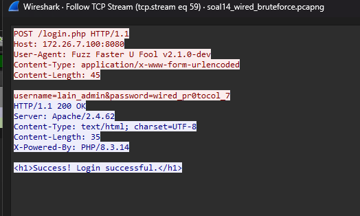

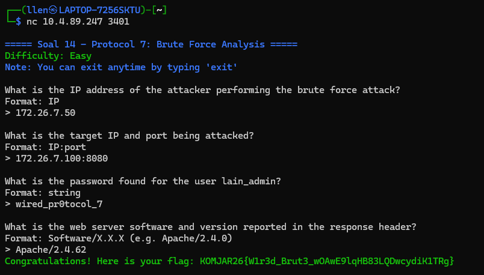

---

### Soal 15 — Analisis USB HID Keystroke (`wired_usb_hid.pcap`)

**Deskripsi Soal**
Menganalisis berkas capture `wired_usb_hid.pcap` untuk mengekstrak informasi perangkat USB (keyboard) beserta data keystroke yang direkam.

**Metodologi**
Setiap paket diiterasi untuk menemukan informasi *device descriptor* USB, khususnya USB Vendor ID, Product ID, serta alamat (address) yang di-assign ke perangkat keyboard.

**Temuan**

| Informasi | Nilai |
| --- | --- |
| USB Vendor ID | `0x046d` |
| USB Product ID | `0xc31c` |
| USB Address (keyboard) | `7` |
| Pesan hasil rekonstruksi keystroke | `Wired_protocol_7_is_alive_2026` |

Temuan divalidasi menggunakan NetCat, dan diperoleh flag:

```
KOMJAR26{USB_K3ystr0k3_ykflmb5AX0yseorAoc7ctezEa}
```

**Screenshot**

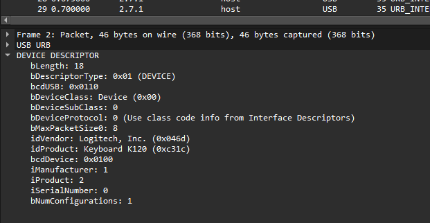

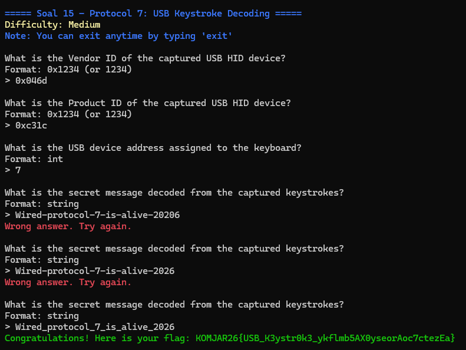

---

### Soal 16 — Analisis Pencurian Data via FTP (`wired_ftp_theft.pcap`)

**Deskripsi Soal**
Menganalisis berkas capture `wired_ftp_theft.pcap` untuk mengungkap aktivitas pencurian data melalui protokol FTP.

**Metodologi**
Filter `tcp` diterapkan untuk menyaring seluruh trafik TCP, kemudian ditelusuri IP yang mencurigakan.

**Temuan**

| Informasi | Nilai |
| --- | --- |
| IP mencurigakan | `198.51.100.7` |
| Banner FTP server | `220 Welcome to Wired FTP Server (vsftpd 3.0.5)` |
| Username (paket Login) | `knights_agent` |
| Password | `N4v1_s3cur3_2026` |
| Berkas malware yang ditransfer | `knights_payload.exe` (524.288 bytes) |

Temuan divalidasi menggunakan NetCat, dan diperoleh flag:

```
KOMJAR26{FTP_Th3ft_vInOlrtQcMYRwzQBZciO0tPdl}
```

**Screenshot**

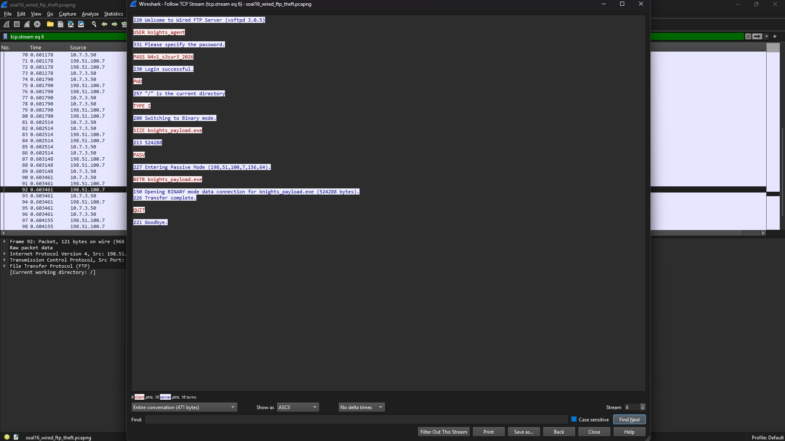

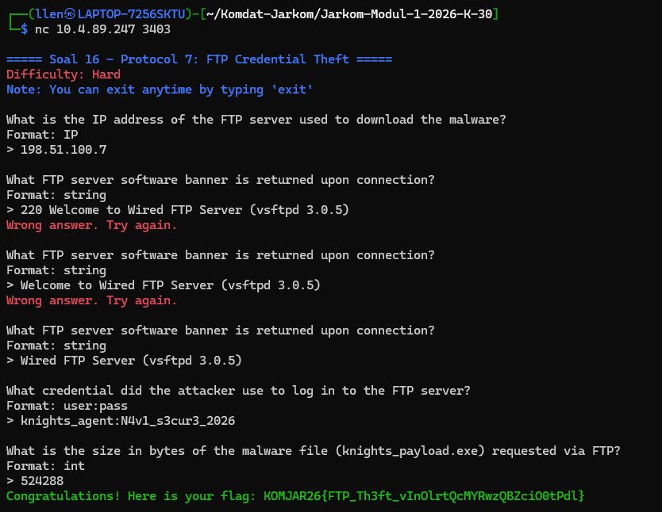

---

### Soal 17 — Analisis Command & Control via HTTP (`soal17_wired_http_c2.pcapng`)

**Deskripsi Soal**
Menganalisis berkas capture `soal17_wired_http_c2.pcapng` untuk mengidentifikasi indikasi komunikasi *Command & Control* (C2) melalui protokol HTTP.

**Metodologi**
Filter `http` diterapkan untuk menyaring trafik HTTP, kemudian dicari paket dengan permintaan pengunduhan berkas mencurigakan.

**Temuan**

| Informasi | Nilai |
| --- | --- |
| Request | `GET /navi_agent.exe HTTP/1.1` |
| Source IP | `10.7.1.50` |
| Destination IP (attacker) | `203.0.113.42` |
| Response | `200 OK` |
| Domain (dari HTTP stream) | `wired-update.net` |

Destination IP merespons dengan kode `200 OK`, dan melalui fitur *Follow HTTP Stream* ditemukan nama domain C2 server. Temuan divalidasi menggunakan NetCat, dan diperoleh flag:

```
KOMJAR26{Navi_C2_D0wnl04d_HWniZv9tT2tRTOi4VaP13KoCX}
```

**Screenshot**

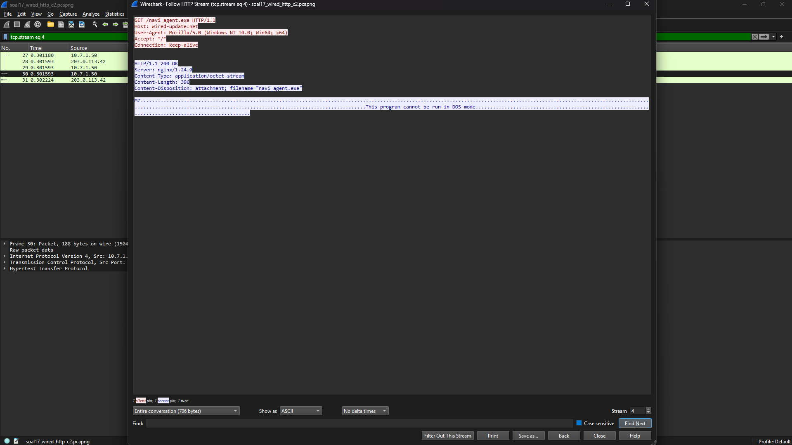

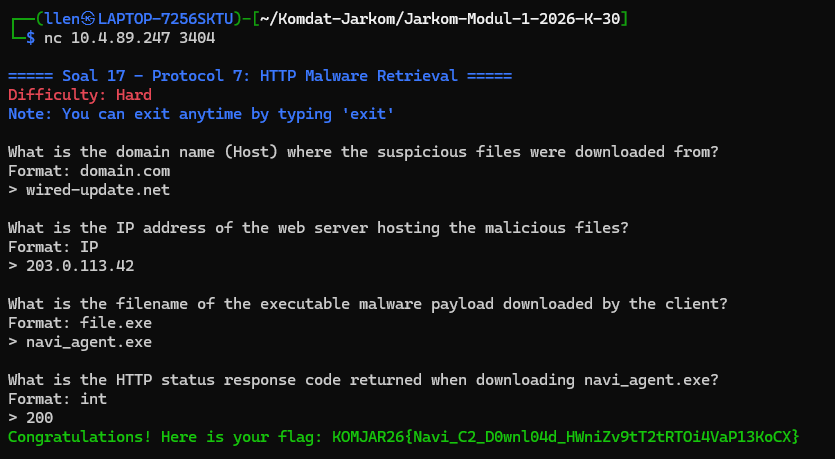

---

### Soal 18 — Analisis Eksploitasi SMB (`wired_smb_transfer.pcapng`)

**Deskripsi Soal**
Menganalisis berkas capture `wired_smb_transfer.pcapng` untuk mengidentifikasi upaya eksploitasi melalui protokol SMB2.

**Metodologi**
Filter `smb2` diterapkan untuk menyaring trafik SMB versi 2, kemudian dicari paket dengan operasi pembuatan berkas (*Create Request*).

**Temuan**

| Informasi | Nilai |
| --- | --- |
| Operasi | `Create Request` |
| File target | `System32\wired_trojan_payload.exe` |
| IP terlibat | `10.7.1.50` dan `10.7.3.100` |

Protokol SMB2 teridentifikasi coba dieksploitasi oleh kedua IP tersebut untuk menempatkan payload trojan pada direktori sistem. Diperoleh flag:

```
KOMJAR26{SMB_Tr4nsf3r_dZV7VJFefaj0USZtXMpRkPDZ8}
```

**Screenshot**

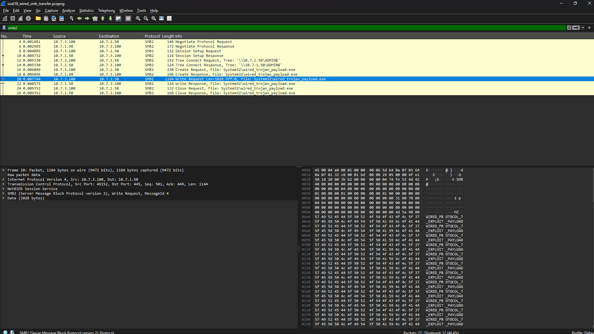

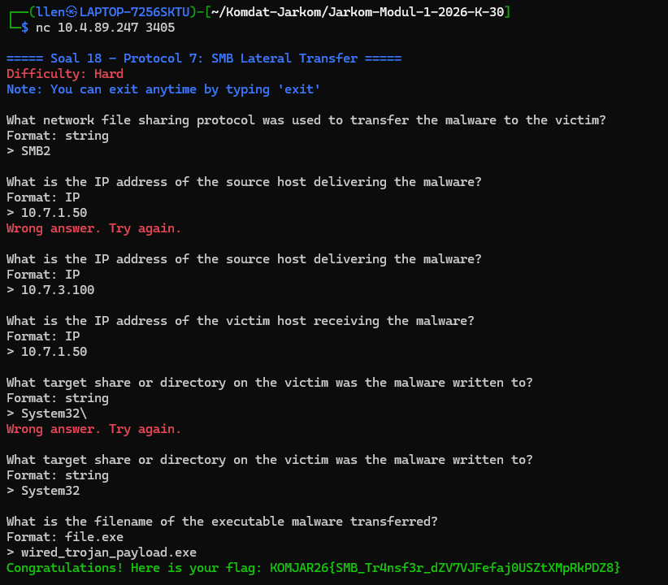

---

### Soal 19 — Analisis Ancaman/Pemerasan via SMTP (`wired_smtp_threat.pcap`)

**Deskripsi Soal**
Menganalisis berkas capture `wired_smtp_threat.pcap` untuk mengungkap isi pesan ancaman (pemerasan) yang dikirim melalui protokol SMTP.

**Metodologi**
Filter `smtp` diterapkan untuk menyaring trafik SMTP, kemudian ditelusuri isi pesan yang dikirimkan.

**Temuan**

| Informasi | Nilai |
| --- | --- |
| Pengirim (attacker) | `attacker@darkwired.net` |
| Penerima (victim) | `victim@protocol7.co.jp` |
| Password korban (hasil ransomware) | `pr0tocol_7_user` |
| Batas waktu yang diberikan | 3 hari |
| Mail Client ID | `7719980706` |

Isi pesan menunjukkan attacker memberitahukan bahwa mereka telah memperoleh password korban melalui ransomware, dan memberikan batas waktu 3 hari kepada korban. Diperoleh flag:

```
KOMJAR26{SMTP_Ext0rt10n_sk4MOasOWoubqy1PiSNPRqu18}
```

**Screenshot**

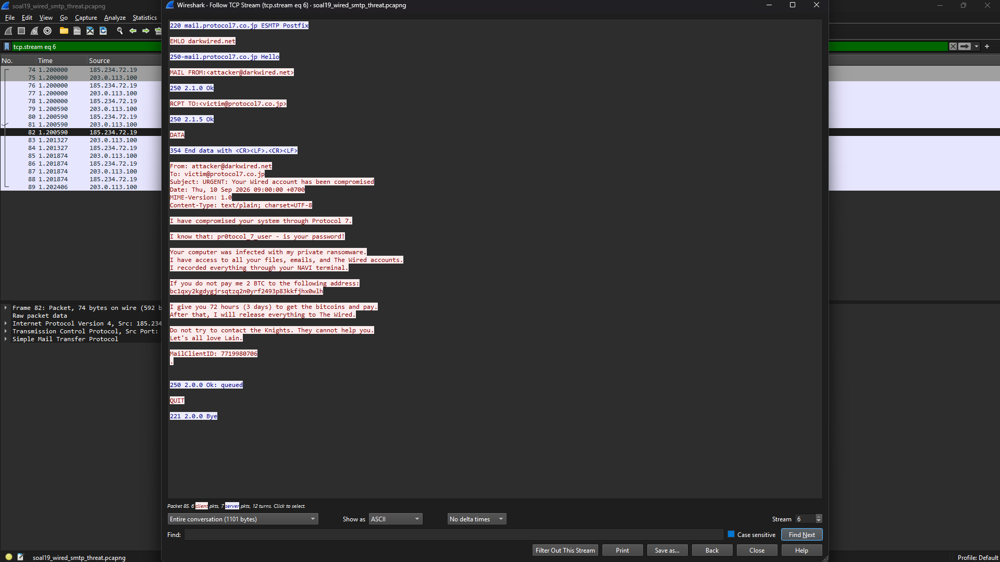

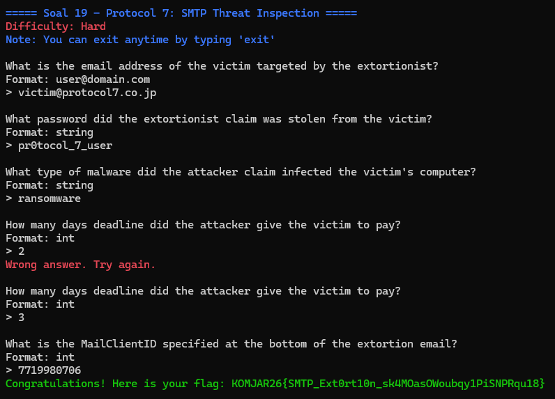

---

### Soal 20 — Dekripsi TLS (`wired_tls_decrypt.pcapng`)

**Deskripsi Soal**
Melakukan dekripsi terhadap berkas capture `wired_tls_decrypt.pcapng` menggunakan *keylog file* yang disediakan, kemudian menganalisis detail sesi HTTPS yang telah terdekripsi.

**Metodologi**
Pada Wireshark, buka **Edit → Preferences → Protocols → TLS**, lalu tambahkan berkas `keyslogfile.txt` pada bagian *(Pre)-Master-Secret log filename*, sehingga trafik TLS dapat didekripsi dan detail paket dapat dianalisis.

**Temuan**

| Informasi | Nilai |
| --- | --- |
| Versi TLS | `TLSv1.2` |
| Domain yang di-request client (TLS Handshake / SNI) | `example.com` |
| IP Address server HTTPS | `93.184.216.34` |
| User-Agent client (session terdekripsi) | `curl/7.62.0` |
| HTTP Request | `HEAD / HTTP/1.1` |

Diperoleh flag:

```
KOMJAR26{TLS_D3crypt_2Yi1XBuXmLxdeneAp7nWTWESH}
```

**Screenshot**

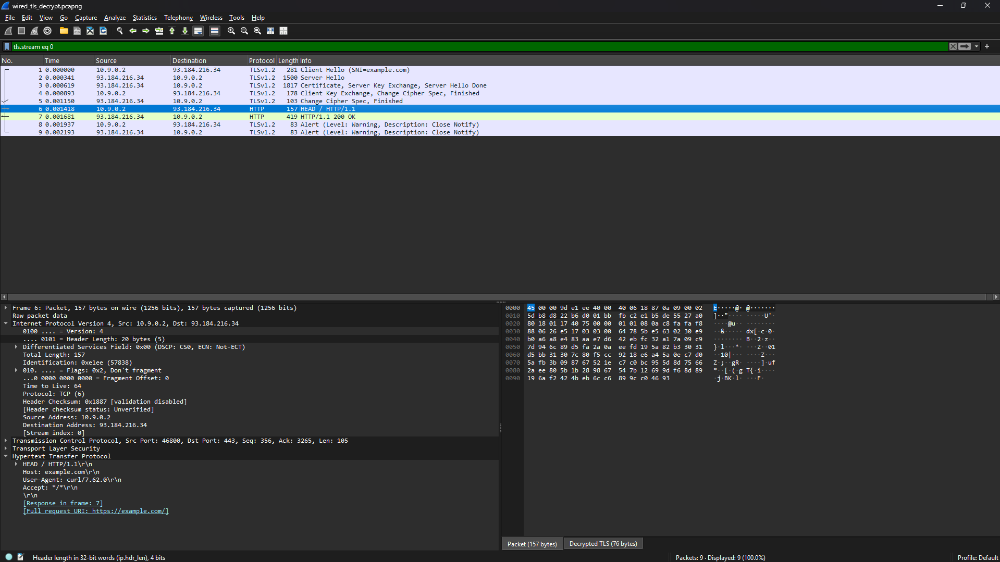

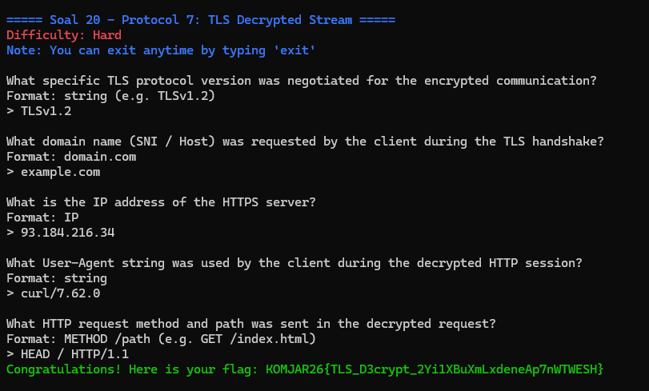

---
